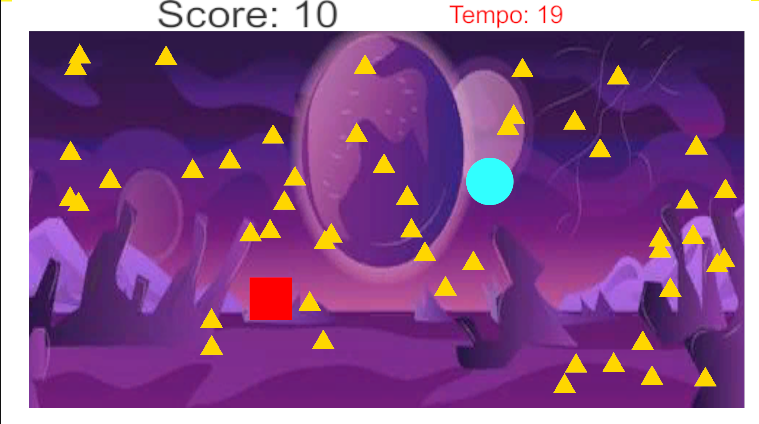

# ⭐ PKGalaxia

PKGalaxia é um jogo 2D desenvolvido em Unity com o objetivo de resgatar todos os pontos (triângulos) antes que o tempo acabe. Mas cuidado! O vilão (quadrado) está te perseguindo e, se encostar em você, o jogo acaba!

## 🎮 Como Jogar

- Use as **setas do teclado** ou **WASD** para mover seu personagem (círculo).
- Colete todos os triângulos antes do tempo chegar a zero ⏱️.
- Fuja do vilão (quadrado vermelho)! Se ele te alcançar, é **fim de jogo**.
- Vença ao coletar todos os pontos antes do tempo acabar! 🏆

## 📷 Captura de tela

## 💻 Tecnologias Utilizadas

- [Unity 6](https://unity.com/)
- C#
- itch.io (para publicação WebGL)

## 📦 Build Web

O jogo pode ser jogado online através do link:  
👉 [https://giovannyjvr.itch.io/pkgalaxia](https://giovannyjvr.itch.io/pkgalaxia)

## 🗂️ Estrutura do Projeto

